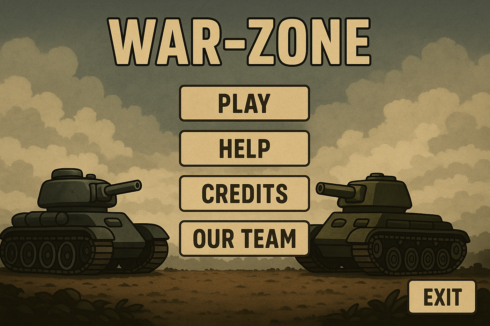
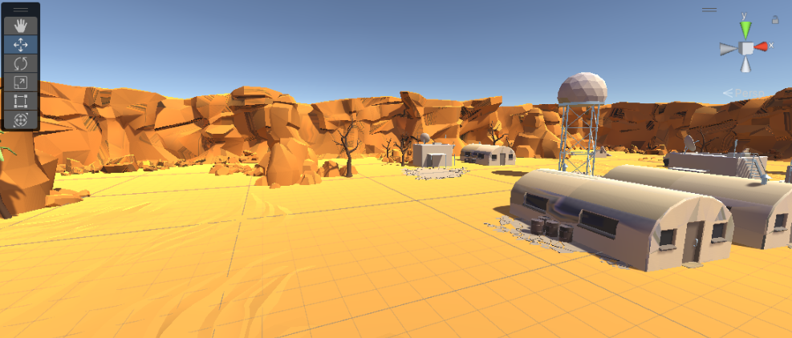
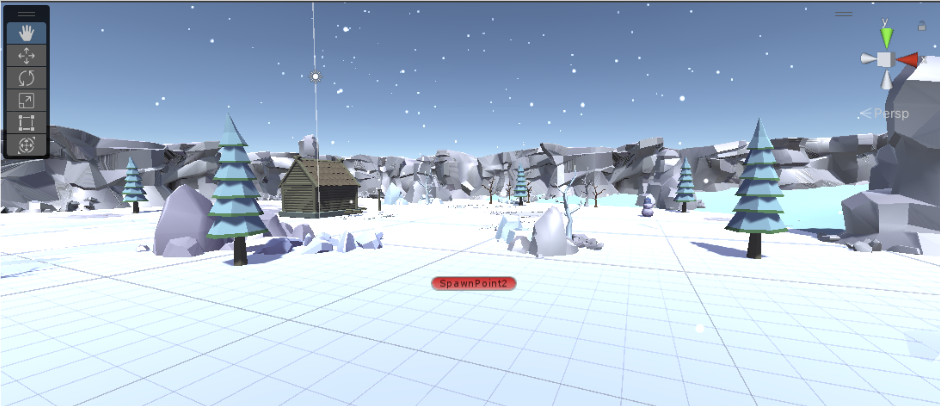
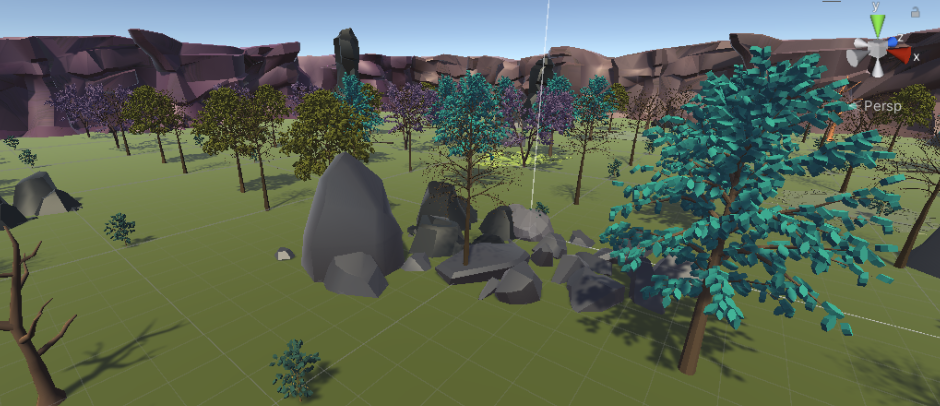
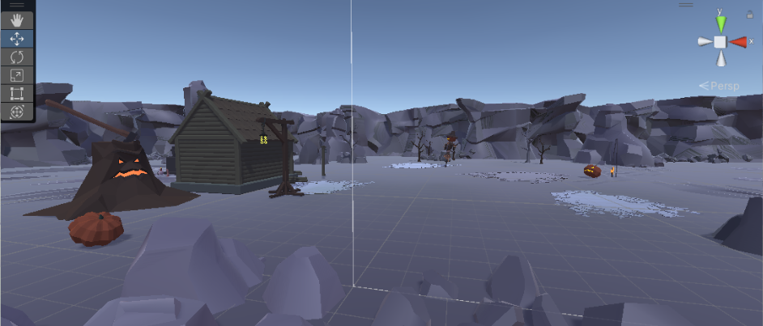

## **War Zone**

##  Overview

War-Zone is a 3D multiplayer tank combat game developed in Unity 3D. It offers intense local two-player battles across four themed environments—Forest, Desert, Snow, and Halloween. The game features physics-based tank movement, chargeable projectile firing, and realistic explosion effects, all enhanced by a dynamic third-person camera system. 

  
   
  

## Player Mission

The goal of WAR-ZONE is to create a fun 3D multiplayer game where players control tanks and try to defeat each other. Players aim, move, and fire powerful shots to reduce their opponent’s health. The game is played in rounds, and the first player to win 3 rounds, becomes the overall winner. The game encourages skill, timing, and strategy.

## Game Architecture

- Front end - User Interface
- Back end - C# Scripts
- Size     - 692 MB

### User interface

a. User Friendly Menus - Simple and clear menu layouts allow players to easily navigate through options, start games, and access help without confusion.
 
b. Guided Gameplay and Dynamic Camera
An interactive “Cacti Friend” character assists players by providing clear instructions and helpful tips to learn the controls quickly, while the dynamic third-person camera automatically adjusts its angle and zoom to keep both tanks visible, ensuring smooth and immersive gameplay.
 
c. Responsive HUD - The heads-up display shows critical information such as tank health,
 projectile charge level, and current round, keeping players informed in
 real-time.

## Environments

1. Desert Scene
   

    
     
    <em>Features sandy textures and scattered rock formations for cover.</em>
   

 
2. Snow Scene
   

    
     
    <em>Snow-covered terrain with icy visual effects creates a chilled battlefield. Continuous snowfall adds atmospheric depth and enhances immersion.</em>
   

 
3. Forest Scene
   

    
     
    <em>Lush greenery and wooden obstacles create a natural, camouflaged  battlefield.</em>
   

 
4. Halloween Scene
   

    
     
    <em>Dark, spooky theme with glowing pumpkins and eerie lighting.Unique obstacles like tombstones and themed props enhance the Halloween atmosphere.</em>
   
   
   

